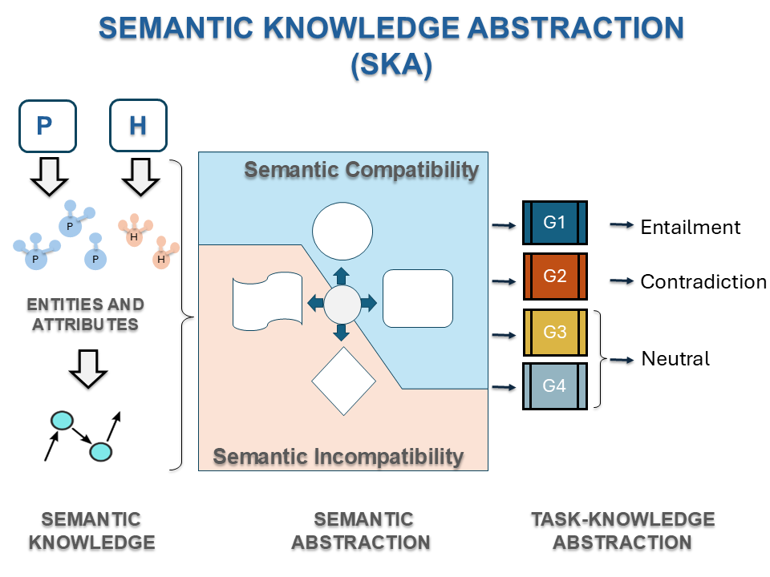
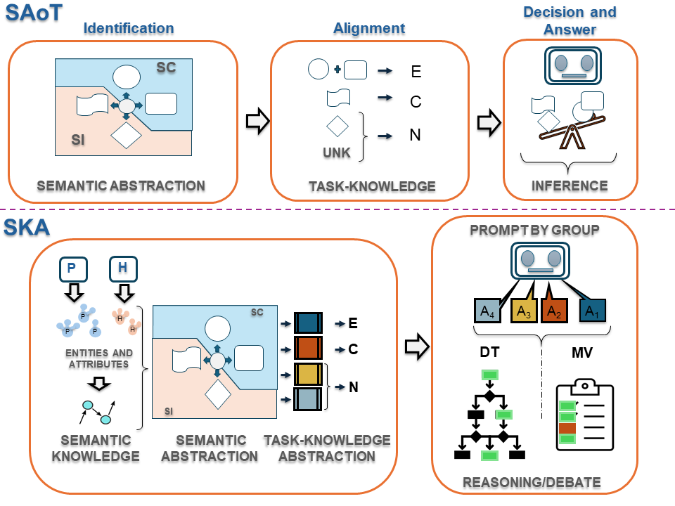

# Semantic-Abstraction-Knowledge--SKA--An-application-in-NLI-task
Semantic Knowledge Abstraction: Consistent Reasoning in LLMs for Natural Language Inference

Methodological framework. From the Premise and Hypothesis, entities and their corresponding attributes are identified and used to extract semantic knowledge from ConceptNet, which is categorized and abstracted into groups. Task knowledge is represented as an alignment between abstraction groups and the target task classes.

Prompting strategies to assess the abstraction framework. SAoT: Semantic Abstraction of Thought. The plan is formulated within the proposed abstraction framework, and the general description of the steps is expressed in terms of this framework, thereby aligning the reasoning process with the target task (NLI). SKA: Semantic Knowledge Abstraction. This approach is grounded in the proposed abstraction
framework, which prompts the LLM through group-based semantic abstraction. The LLM generates responses for each group, which are then consolidated using two mechanisms of reasoning and debate: (1) decision tree (DT) and (2) majority vote (MV).

  
# 🤖 AI Models Comparison
  

<table>
  <thead>
    <tr>
      <th>Company</th>
      <th>Model</th>
      <th>ID</th>
      <th>Size</th>
      <th>Architecture</th>
      <th>Parameters</th>
      <th>Quantization</th>
      <th>Context Length</th>
      <th>Embedding Length</th>
    </tr>
  </thead>
  <tbody>
    <tr>
      <td rowspan="2"><strong>Meta</strong></td>
      <td><code>llama3.1:latest</code></td>
      <td><code>91ab477bec9d</code></td>
      <td>4.7 GB</td>
      <td>llama</td>
      <td>8.0B</td>
      <td>Q4_0</td>
      <td>131072</td>
      <td>4096</td>
    </tr>
    <tr>
      <td><code>llama3.2:latest</code></td>
      <td><code>a80c4f17acd5</code></td>
      <td>2.0 GB</td>
      <td>llama</td>
      <td>3.2B</td>
      <td>Q4_K_M</td>
      <td>131072</td>
      <td>3072</td>
    </tr>
    <tr>
      <td rowspan="2"><strong>Google</strong></td>
      <td><code>gemma2:latest</code></td>
      <td><code>ff02c3702f32</code></td>
      <td>5.4 GB</td>
      <td>gemma2</td>
      <td>9.2B</td>
      <td>Q4_0</td>
      <td>8192</td>
      <td>3584</td>
    </tr>
    <tr>
      <td><code>gemma2:2b</code></td>
      <td><code>8ccf136fdd52</code></td>
      <td>1.6 GB</td>
      <td>gemma2</td>
      <td>2.6B</td>
      <td>Q4_0</td>
      <td>8192</td>
      <td>2304</td>
    </tr>
    <tr>
      <td rowspan="2"><strong>Microsoft</strong></td>
      <td><code>phi3:medium</code></td>
      <td><code>cf611a26b048</code></td>
      <td>7.9 GB</td>
      <td>phi3</td>
      <td>14.0B</td>
      <td>Q4_0</td>
      <td>131072</td>
      <td>5120</td>
    </tr>
    <tr>
      <td><code>phi3:latest</code></td>
      <td><code>4f2222927938</code></td>
      <td>2.2 GB</td>
      <td>phi3</td>
      <td>3.8B</td>
      <td>Q4_0</td>
      <td>131072</td>
      <td>3072</td>
    </tr>
  </tbody>
</table>

https://ollama.com/

Evaluation of LLMs on the NLI task (RTEGLUE, SNLI, SciTail, SICK, Diagnostic corpora)

1. Download all the corpora and unzip them into the corpus/ folder.
2. Run the cells in the processCorpus.ipynb notebook. This will create folders in data/datasets/...
3. In the data folder, run the genSamples.ipynb notebook.
4. Run the commands (comands file) to execute the script Relaciones_TH_esp.py, which will search for P-H relations and create groups G1, G2, G3, and G4.
For this, you need to have the virtual environment called rit with Python 3.9.13 (the requirements.txt file is attached).

5. Once we have obtained the relations from all the examples in the corpus samples and baseline, we will call the LLMs with the script callLLM.py and callLLM_base.py

Baseline        callLLM_base.py       ->    LLMs/
AoT             callLLM_AoT.py        ->    LLMs_AoT/
SAoT            callLLM_SAoT.py       ->    LLMs_SAoT/
SAoT+Fewshots   callLLM_SAoT_fs.py    ->    LLMs_SAoT_FS/
Groups          callLLM_SKA.py        ->    LLMs_SKA/

6. To obtain results, it is necessary to validate that the responses from the samples are complete. To do this, run the val_answers_complete_ALL.ipynb notebook (LLMs_SKA) to request a response again (processed/ folder) if one with the correct format is not found. If this attempt is unsuccessful, it is labeled as NA and is not taken into account for the results. This is converted into pickle files stored in the complete/ folder. (LLMs_SKA/model/dataset/)

7. Once the complete samples have been obtained, the notebooks group_results_2labels.ipynb and group_results_3labels.ipynb is executed. The notebook group_results_DIAG.ipynb must also be run to obtain the data from the diagnostic corpus. (https://super.gluebenchmark.com/diagnostics)

8. Our statistical tests require the creation of Cross Validation, where 10 of the 13 samples are chosen to obtain accuracy and 3 are used to train the SKA_DT (our proposal) and to obtain weights for the Weighted Majority Vote WMV results. We process sample 14 to generate the fewshots for AoT_fs.
The generated pickle files have the following format (LLMs_SKA/model/dataset/answers/ folder) for each of the groups G1-G4 and combinations thereof to test new DTs:

VM: Majority vote
WVM: Weighted Majority vote
GS_DT: our proposal 

+Comparison of average accuracy performance between Baseline, AoT, SAoT, SAoT Few Shots, SKA\_MV, and SKA\_DT for the 3-class and 2-class datasets with p-values from Mann-Whitney statistical tests.

